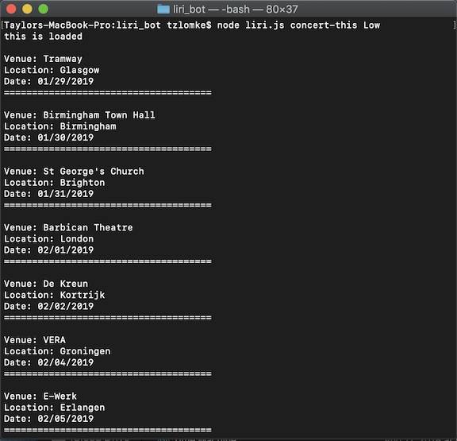
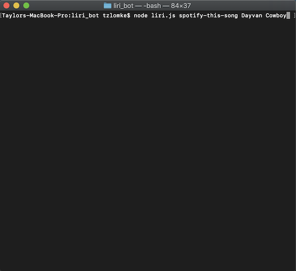
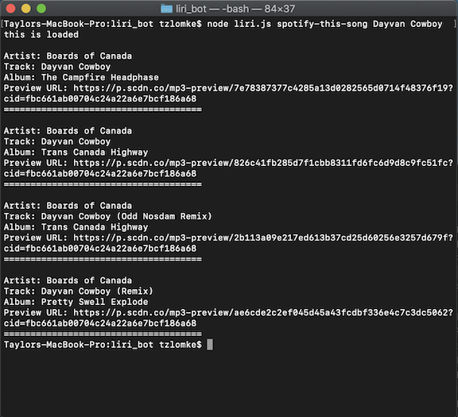
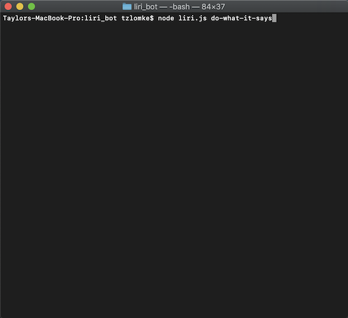

# LIRI Bot

## LIRI Bot: A Language Interpretation and Recognition Interface
LIRI Bot is a node.js-based CLI App designed to receive user queries and locate relevant information on movies, songs and concerts.

## Motivation
The LIRI Bot was an opportunity to get familiarized with CLI apps, NPM packages, and back-end API implementation while creating something that could one day be further developed for real-world use.

## Getting Started
To get started, clone the repository at https://github.com/tzlomke/liri_bot and install the required NPM packages (axios, node-spotify-api, dotenv, and moment). Once installed, LIRI Bot can be run from your preferred command line interface and accepts the following commands:

* concert-this {band name}
    * Searches the Bandsintown API to find scheduled concerts for the artist input by the user.
* spotify-this-song {song title}
    * Searches the Spotify API to find song data related to the user query.
    * Default search is performed if no user query/keyword is entered.
* movie-this {movie title}
    * Searches the OMDB API to find information on the movie input by the user.
    * Default search is performed if no user query/keyword is entered.
* do-what-it-says
    * Does not require a user query/keyword. Uses random.txt file to generate a new command and keyword.

## Commands Explained
Commands are input as simple command line arguments. After typing **node liri.js** to access the program, the desired command makes up the next argument and the keyword(s) follow.

## Examples

### Concert-This
###### Input

###### Output

### Spotify-This-Song
###### Input

###### Output

##### Spotify-This-Song Default
###### Input

###### Output

### Movie-This
###### Input

###### Output

#### Movie-This Default
###### Input

###### Output

### Do-What-It-Says
###### Input

###### Output

## Author
Taylor Zlomke | https://github.com/tzlomke/